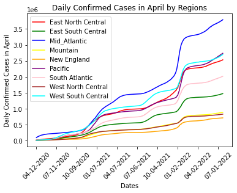

# Covid-Data-Analysis

## About
This project looks at the spread of the COVID-19 virus across the US regions over the last two years. The graph below shows the results. Check out [here](Covid_19_Final_Project_2022.ipynb) for the project code.

## Description
The line graph illustrates changes in the levels of average daily COVID-19 confirmed cases in nine US regions from 2020 to 2022 and is measured in the number of people infected. Overall, it can be seen that, over the period as a whole the levels of confirmed cases rose in all nine regions.
Moving to a more detailed analysis, the total average number of confirmed cases  in the Mid-Atlantic region increased dramatically and they overtook all eight regions from the first quarter of 2021. 
Pacific, East North Central, and West South Central are the next regions with highest confirmed cases and followed a similar trend, increasing steadily to approximately 30%. 
Finally, if you look for patterns you will see that Mountain, New England and West North Central regions follow a similar pattern (increasing gradually over the period) which tells us the mentioned regions had more effective preventive actions.
